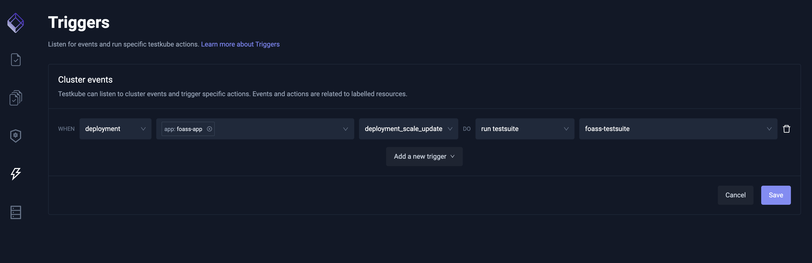
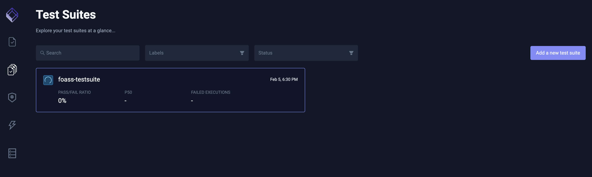

# testkube-hand-on-demo
This repository contains simple 6 steps example how you can use testkube to execute tests at kubernetes cluster. You can run this demo locally at your own laptop, this demo uses minikube cluster to host kubernetes installation. 

# About TestKube 
Testkube is native testing framework for kubernetes applications.

# System under test
FOASS (Fuck Off As A Service) provides a modern, RESTful, scalable solution to the common problem of telling people to fuck off. 
https://foass.1001010.com/

# Step 1. Install Minikube cluster
For Linux users:
```
curl -LO https://storage.googleapis.com/minikube/releases/latest/minikube-linux-amd64
sudo install minikube-linux-amd64 /usr/local/bin/minikube
```
Note: For other operation systems see Minikube installation instruction from here: https://minikube.sigs.k8s.io/docs/start/

Start Minikube
```
minikube start
```

# Step 2. Install Testkube into cluster
For Linux users:
```
wget -qO - https://repo.testkube.io/key.pub | sudo apt-key add - && echo "deb https://repo.testkube.io/linux linux main" | sudo tee -a /etc/apt/sources.list && sudo apt-get update && sudo apt-get install -y testkube
```

Note: For other operation systems see Testkube installation instruction from here: https://kubeshop.github.io/testkube/installing/

Open up testkube dashboard
```
kubectl testkube dashboard
```


# Step 3. Deploy SUT into cluster
Run following commands to deploy SUT into minikube cluster
```
kubectl create -f deployment/namespace.yaml
kubectl apply -f deployment/foass-deployment.yaml
```

You should get output like this: 


# Step 4. Create tests
This step we run multiple simple tests agains our foass SUT which is now currently deployed into minikube cluster. All tests are configured to find SUT by it's kube dns name foass-app.<namespace>.srv.cluster.local

Explanation for tests: 
- foass-ui-test - is a simple UI test for testing FOASS UI to find out "foass" test from page.
- foass-health.postman_collection - tests that service health endpoint replies (SUT endpoint/health -> see https://foass.1001010.com/health)
- foass-curl-test - tests that service is up and running and curl gets HTTP 200 OK response
- foass-artillery-api-test - is a simple load testing for stress out foass health endpoint 

```
# Tests creation
kubectl testkube create test --name foass-ui-test --file tests/foass-ui-tests.js --type cypress/project
kubectl testkube create test --name foass-api-test --file ./tests/foass-health.postman_collection.json --type postman/collection
kubectl testkube create test --name foass-curl-test --file tests/foass-curl-tests.json --type curl/test
kubectl testkube create test --name foass-artillery-api-test --file ./tests/foass-artillery-api-test.yaml --type artillery/test
```

Output...


# Step 5. Create test suite
Test suite is useful to create collection of tests, so you can then afterward manage tests easier by executing suite to run suite it's tests.

```
kubectl apply -f ./tests/foass-testsuite.yaml
```

Verify suite creation from testkube dashboard or using testkube CLI


# Step 6. Execute tests and view results
```
kubectl testkube run testsuite foass-testsuite
```


If you got a similar view on the Dashboard, congratulations on the successful execution of the tests!! :)

# Other topics to test

## Test Triggers
Test triggers can be used to trigger testcase or testsuite execution based on the Kubernetes cluster events. This helps lots of testing, we do not need to trigger testing from CICD all cases, tests can be triggered event cluster events hapens, case new deployment, deployment deletion, scaling etc. This feature is really useful example to run regression testing to applications. Here is simple steps to setup Cluster trigger:

```
kubectl apply -f triggers/test-trigger.yaml
```

Now you have created trigger into testkube and you can see trigger from testkube dashboad.


This trigger will trigger every time when you scale foass deployment. So scaling deployment run following command:
```
kubectl scale --replicas=0 deployment/foass-deployment -n foass
```

And tests will trigger when deployment is scaled.




# Other interesting topics relating to Testkube 
- [Test Scheduling](https://kubeshop.github.io/testkube/using-testkube/scheduling)
- [Artifacts Storage](https://kubeshop.github.io/testkube/using-testkube/artifacts-storage)
- [Metrics](https://kubeshop.github.io/testkube/using-testkube/metrics)
- [CI integration](https://kubeshop.github.io/testkube/integrations/testkube-automation)

# Links
- [TestKube the Kubernetes native testing framework TestKube](https://kubeshop.github.io/testkube/)
- [Minikube local kubernetes cluster of macOS, Linux and Windows](https://minikube.sigs.k8s.io/docs/)
- [Artillery.io the most advanced loadtesting platform in the world](https://www.artillery.io/)
